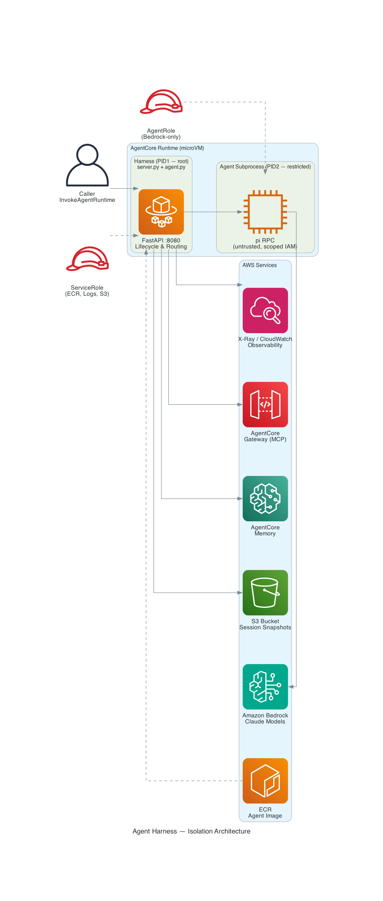

# Deploy a Custom Agent to Amazon Bedrock AgentCore Runtime via ECR

This guide deploys a coding agent (pi-mono) to AgentCore Runtime using a custom Docker container pushed to ECR — no `bedrock-agentcore` SDK required. The agent implements the AgentCore HTTP contract directly with FastAPI.

## Why This Architecture?

Autonomous agents with filesystem tools and code execution capabilities must be treated as **untrusted entities**. The harness pattern isolates the agent's self-inspection and mutation capabilities:

- **Process isolation** — The agent subprocess (PID2) runs as a restricted user with scoped IAM credentials (Bedrock-only). It cannot access the harness code, S3 credentials, or Memory/Gateway APIs.
- **Container-as-boundary** — Each session runs in its own microVM. The agent cannot escape to other sessions or the host.
- **Credential scoping** — The harness (PID1) holds full permissions but never exposes them to the agent. The agent gets short-lived, least-privilege credentials via STS AssumeRole with inline policy.
- **Observability without trust** — The harness instruments all operations (OTEL spans) independently of the agent, so you get traces even if the agent misbehaves.

This separation means you can swap in any autonomous agent (Claude Code, Codex, custom LLM loops) while maintaining the same security boundary.

## Architecture



```
User → InvokeAgentRuntime API → AgentCore Runtime → Container (FastAPI :8080)
                                                        ├── POST /invocations → agent.handle() → PiRpc → Bedrock (Claude)
                                                        ├── GET /ping → Healthy / HealthyBusy
                                                        ├── S3 snapshot/restore (async after each response)
                                                        ├── AgentCore Memory (store/retrieve conversation context)
                                                        ├── AgentCore Gateway (external tool discovery via MCP)
                                                        └── OpenTelemetry → X-Ray (traces for every invocation)
```

## What This Project Does

- Wraps the `pi` coding agent in a FastAPI server that implements AgentCore's HTTP contract (`POST /invocations`, `GET /ping`)
- Manages a long-running pi subprocess via JSON-line RPC (stdin/stdout)
- Snapshots the full session state (conversation history + workspace files) to S3 after every response
- Restores from S3 on cold start so the agent survives container recycling
- Instruments all operations with OpenTelemetry traces exported to AWS X-Ray
- One container = one session = one pi process

## Architecture

```
User → InvokeAgentRuntime API → AgentCore Runtime → Container (FastAPI :8080)
                                                        ├── POST /invocations → agent.handle() → PiRpc → Bedrock (Claude)
                                                        ├── GET /ping → Healthy / HealthyBusy
                                                        ├── S3 snapshot/restore (async after each response)
                                                        └── OpenTelemetry → X-Ray (traces for every invocation)
```

## Prerequisites

- AWS account with Bedrock model access enabled for `us.anthropic.claude-sonnet-4-6`
- Docker with buildx (for ARM64 cross-compilation)
- AWS CLI v2 configured with credentials that can create IAM roles, ECR repos, and AgentCore runtimes
- Python 3.10+ with boto3 installed locally (for deploy/invoke scripts)

## File Overview

| File | Description | Modify? |
|------|-------------|---------|
| `server.py` | AgentCore HTTP boilerplate — `/invocations` and `/ping` endpoints. Calls `agent.handle()` | **No** — this is the boilerplate |
| `agent.py` | Agent logic — pi RPC, S3 snapshots, observability, `handle(session_id, prompt)` entrypoint | **Yes** — customize this |
| `Dockerfile` | ARM64 container: Node.js 20 + pi (npm) + Python + FastAPI/uvicorn | As needed |
| `requirements.txt` | Python dependencies | As needed |
| `deploy.sh` | One-shot deployment script | Set your variables at the top |
| `.dockerignore` | Excludes dev artifacts from Docker build context | Rarely |

### How the split works

```
server.py (DON'T TOUCH)          agent.py (CUSTOMIZE THIS)
┌─────────────────────┐          ┌──────────────────────────┐
│ POST /invocations    │──calls──▶│ handle(session_id, prompt)│
│ GET  /ping           │          │   → your agent logic      │
│ HealthyBusy tracking │          │   → returns {"result":..} │
└─────────────────────┘          └──────────────────────────┘
```

The `handle()` function is the only contract between the two files:
- Input: `session_id` (str), `prompt` (str)
- Output: `{"result": "..."}` on success, `{"error": "..."}` on failure
- It runs in a thread pool so it can be blocking (no async needed)

---

## Step-by-Step Deployment

### 1. Set Up Variables

Export these variables in your terminal. **Replace the placeholder values with your own.**

```bash
# Your 12-digit AWS account ID (find it in the AWS Console top-right, or run: aws sts get-caller-identity --query Account --output text)
export ACCOUNT_ID="<ACCOUNT_ID>"

# AWS region for deployment
export REGION="us-east-1"

# Names (you can change these)
export AGENT_NAME="pi-mono"
export ECR_REPO="pi-mono-agent-ecr"
export SNAPSHOT_BUCKET="pi-mono-agent-snapshots-${ACCOUNT_ID}"
export ROLE_NAME="AgentCoreRuntime-pi-mono-ecr"
```

> **Tip:** Run `aws sts get-caller-identity --query Account --output text` to get your account ID.

### 2. Create the S3 Snapshot Bucket

```bash
aws s3 mb s3://${SNAPSHOT_BUCKET} --region ${REGION}
```

### 3. Create the IAM Execution Role

This creates the role with the trust policy and attaches the required permissions:

```bash
# Create the trust policy file
cat > /tmp/trust-policy.json << EOF
{
  "Version": "2012-10-17",
  "Statement": [
    {
      "Sid": "AllowAgentCoreAssume",
      "Effect": "Allow",
      "Principal": {
        "Service": "bedrock-agentcore.amazonaws.com"
      },
      "Action": "sts:AssumeRole",
      "Condition": {
        "StringEquals": {
          "aws:SourceAccount": "${ACCOUNT_ID}"
        },
        "ArnLike": {
          "aws:SourceArn": "arn:aws:bedrock-agentcore:${REGION}:${ACCOUNT_ID}:*"
        }
      }
    }
  ]
}
EOF

# Create the role
aws iam create-role \
  --role-name ${ROLE_NAME} \
  --assume-role-policy-document file:///tmp/trust-policy.json

# Create the permissions policy file
cat > /tmp/permissions-policy.json << EOF
{
  "Version": "2012-10-17",
  "Statement": [
    {
      "Sid": "ECRPull",
      "Effect": "Allow",
      "Action": [
        "ecr:BatchGetImage",
        "ecr:GetDownloadUrlForLayer",
        "ecr:GetAuthorizationToken"
      ],
      "Resource": "*"
    },
    {
      "Sid": "CloudWatchLogs",
      "Effect": "Allow",
      "Action": [
        "logs:CreateLogGroup",
        "logs:CreateLogStream",
        "logs:PutLogEvents",
        "logs:DescribeLogStreams",
        "logs:DescribeLogGroups"
      ],
      "Resource": "arn:aws:logs:${REGION}:${ACCOUNT_ID}:*"
    },
    {
      "Sid": "XRayTracing",
      "Effect": "Allow",
      "Action": [
        "xray:PutTraceSegments",
        "xray:PutTelemetryRecords",
        "xray:GetSamplingRules",
        "xray:GetSamplingTargets"
      ],
      "Resource": "*"
    },
    {
      "Sid": "CloudWatchMetrics",
      "Effect": "Allow",
      "Action": "cloudwatch:PutMetricData",
      "Resource": "*",
      "Condition": {
        "StringEquals": {
          "cloudwatch:namespace": "bedrock-agentcore"
        }
      }
    },
    {
      "Sid": "BedrockInvoke",
      "Effect": "Allow",
      "Action": [
        "bedrock:InvokeModel",
        "bedrock:InvokeModelWithResponseStream"
      ],
      "Resource": "*"
    },
    {
      "Sid": "S3Snapshots",
      "Effect": "Allow",
      "Action": [
        "s3:GetObject",
        "s3:PutObject",
        "s3:ListBucket"
      ],
      "Resource": [
        "arn:aws:s3:::${SNAPSHOT_BUCKET}",
        "arn:aws:s3:::${SNAPSHOT_BUCKET}/*"
      ]
    },
    {
      "Sid": "AgentCoreWorkloadIdentity",
      "Effect": "Allow",
      "Action": "bedrock-agentcore:GetWorkloadAccessToken*",
      "Resource": "*"
    }
  ]
}
EOF

# Attach the permissions policy to the role
aws iam put-role-policy \
  --role-name ${ROLE_NAME} \
  --policy-name AgentCoreExecutionPolicy \
  --policy-document file:///tmp/permissions-policy.json

echo "Role ARN: arn:aws:iam::${ACCOUNT_ID}:role/${ROLE_NAME}"
```

### 4. Create ECR Repository, Build, and Push

```bash
# Create the ECR repository
aws ecr create-repository --repository-name ${ECR_REPO} --region ${REGION}

# Authenticate Docker to ECR
aws ecr get-login-password --region ${REGION} | \
  docker login --username AWS --password-stdin ${ACCOUNT_ID}.dkr.ecr.${REGION}.amazonaws.com

# Build ARM64 image and push (AgentCore runs on Graviton — ARM64 is required)
docker buildx create --use 2>/dev/null || true
docker buildx build --platform linux/arm64 \
  -t ${ACCOUNT_ID}.dkr.ecr.${REGION}.amazonaws.com/${ECR_REPO}:latest --push .

# Verify the image was pushed
aws ecr describe-images --repository-name ${ECR_REPO} --region ${REGION} \
  --query 'imageDetails[0].{pushed: imagePushedAt, tags: imageTags}'
```

### 5. Deploy to AgentCore Runtime

```bash
# Create the agent runtime — capture the runtime ID from the output
RUNTIME_RESPONSE=$(aws bedrock-agentcore-control create-agent-runtime \
  --agent-runtime-name ${AGENT_NAME} \
  --container-uri ${ACCOUNT_ID}.dkr.ecr.${REGION}.amazonaws.com/${ECR_REPO}:latest \
  --role-arn arn:aws:iam::${ACCOUNT_ID}:role/${ROLE_NAME} \
  --network-mode PUBLIC \
  --environment-variables SNAPSHOT_BUCKET=${SNAPSHOT_BUCKET},OTEL_ENABLED=true \
  --idle-session-timeout-in-seconds 900 \
  --max-session-lifetime-in-seconds 28800 \
  --region ${REGION})

# Extract and save the runtime ID for later use
export RUNTIME_ID=$(echo ${RUNTIME_RESPONSE} | python3 -c "import sys,json; print(json.load(sys.stdin)['agentRuntimeId'])")
echo "Runtime ID: ${RUNTIME_ID}"
echo "Runtime ARN: arn:aws:bedrock-agentcore:${REGION}:${ACCOUNT_ID}:runtime/${AGENT_NAME}"
```

Wait for the runtime to become `READY`:

```bash
# Poll until ready (usually takes 2-5 minutes)
while true; do
  STATUS=$(aws bedrock-agentcore-control get-agent-runtime \
    --agent-runtime-id ${RUNTIME_ID} --region ${REGION} \
    --query 'status' --output text)
  echo "Status: ${STATUS}"
  if [ "${STATUS}" = "READY" ]; then break; fi
  sleep 10
done
```

### 6. Invoke the Agent

```bash
# Generate a session ID (must be 33+ characters — AgentCore requirement)
export SESSION_ID=$(python3 -c "import uuid; print(str(uuid.uuid4()) + '-extra-chars-for-length')")

aws bedrock-agentcore invoke-agent-runtime \
  --agent-runtime-arn arn:aws:bedrock-agentcore:${REGION}:${ACCOUNT_ID}:runtime/${AGENT_NAME} \
  --runtime-session-id ${SESSION_ID} \
  --payload '{"prompt": "What files are in /workspace?"}' \
  --region ${REGION}
```

> **Note:** Same `SESSION_ID` = same container (stateful conversation). Different `SESSION_ID` = fresh container.

### 7. Stop a Session (Optional)

```bash
aws bedrock-agentcore stop-runtime-session \
  --agent-runtime-arn arn:aws:bedrock-agentcore:${REGION}:${ACCOUNT_ID}:runtime/${AGENT_NAME} \
  --runtime-session-id ${SESSION_ID} \
  --region ${REGION}
```

---

## Customizing the Agent

The `agent.py` file has clearly marked sections. Look for:

```python
# ══════════════════════════════════════════════════════════════════════════════
# CUSTOMIZE: Your agent logic goes here
# ══════════════════════════════════════════════════════════════════════════════
```

The key extension points are:

1. **`handle()` function** — The main entrypoint. Add pre/post processing, context enrichment, or replace the pi RPC entirely with your own agent.
2. **`PiRpc` class** — Replace this with your own agent subprocess or SDK calls if you're not using pi.
3. **Credential scoping** — Adjust `get_scoped_credentials_env()` to add permissions your agent needs.

---

## Observability (OpenTelemetry + X-Ray)

The agent includes built-in OpenTelemetry instrumentation that exports traces to AWS X-Ray. This gives you:

- **Per-invocation traces** — see the full lifecycle of each `handle()` call
- **Pi RPC spans** — timing for each prompt sent to the pi subprocess
- **S3 snapshot spans** — timing for snapshot/restore operations
- **Error recording** — exceptions are captured as span events

### How It Works

When `OTEL_ENABLED=true` (set as an environment variable at deploy time), the agent:
1. Initializes an OTLP exporter pointing to the X-Ray daemon (provided by AgentCore)
2. Creates spans for `handle()`, `pi.prompt()`, `snapshot_to_s3()`, and `restore_from_s3()`
3. Adds attributes like `session_id`, `prompt_length`, `snapshot_file_count`

### Viewing Traces

1. Open the [AWS X-Ray console](https://console.aws.amazon.com/xray/home)
2. Go to **Traces** → filter by service name `pi-mono-agent`
3. Each invocation shows the full span tree

### Disabling Observability

Set `OTEL_ENABLED=false` or remove the environment variable. The agent falls back to no-op tracing with zero overhead.

---

## How the Agent Works

### HTTP Contract (server.py)

AgentCore requires two endpoints on port 8080:

- `POST /invocations` — receives `{"prompt": "..."}`, extracts session ID from the `X-Amzn-Bedrock-AgentCore-Runtime-Session-Id` header, calls `agent.handle()`, returns the result as JSON.
- `GET /ping` — returns `{"status": "Healthy"}` or `{"status": "HealthyBusy"}` while processing. Returning `HealthyBusy` prevents AgentCore from killing the container during long-running prompts.

### Pi RPC Protocol (agent.py)

The agent starts a `pi --mode rpc` subprocess and communicates via JSON lines on stdin/stdout:
1. Send `{"type": "prompt", "message": "..."}` on stdin
2. Read stdout lines until `{"type": "agent_end"}` appears
3. Send `{"type": "get_last_assistant_text"}` to get the final response
4. UI confirmation requests (tool approvals) are auto-accepted

### S3 Snapshot/Restore (agent.py)

- **Snapshot**: After every `handle()` call, a background thread uploads all files from `/home/agent/.pi/` (conversation history) and `/workspace/` (user files) to S3 under `<session_id>/`.
- **Restore**: On cold start (container recycled), before starting pi, the agent checks S3 for an existing snapshot and downloads it. Pi is then started with `--continue` to resume the conversation.

---

## Validation Tests

| # | Test | How to verify |
|---|------|--------------|
| 1 | Tool invocation | Ask pi to create a file — it should use bash/write tools |
| 2 | Filesystem ops | Write, read, list files in /workspace |
| 3 | Session isolation | Use two different session IDs — each gets an independent empty /workspace |
| 4 | S3 snapshot | After an invocation, check `s3://${SNAPSHOT_BUCKET}/${SESSION_ID}/` for uploaded files |
| 5 | Cold-start restore | Stop the session, invoke again with the same session ID — agent should remember conversation and files |
| 6 | Observability | Check X-Ray console for traces after an invocation |

## Key Configuration

| Setting | Value | Notes |
|---------|-------|-------|
| Port | 8080 | Required by AgentCore |
| Architecture | linux/arm64 | AgentCore runs on Graviton only |
| Model | `us.anthropic.claude-sonnet-4-6` | Via Amazon Bedrock |
| Idle timeout | 900s (15 min) | Configurable at deploy time |
| Max lifetime | 28800s (8 hrs) | Hard cap per container |
| Session ID min length | 33 characters | AgentCore requirement |
| OTEL_ENABLED | true/false | Enable/disable OpenTelemetry tracing |
| MEMORY_ID | (empty) | Set to enable AgentCore Memory (optional) |
| GATEWAY_URL | (empty) | Set to enable AgentCore Gateway (optional) |

---

## Cleanup

```bash
# Delete the agent runtime
aws bedrock-agentcore-control delete-agent-runtime \
  --agent-runtime-id ${RUNTIME_ID} --region ${REGION}

# Delete ECR repository (--force removes all images)
aws ecr delete-repository --repository-name ${ECR_REPO} --force --region ${REGION}

# Delete S3 snapshot bucket (empty it first)
aws s3 rb s3://${SNAPSHOT_BUCKET} --force

# Detach policy and delete IAM role
aws iam delete-role-policy --role-name ${ROLE_NAME} --policy-name AgentCoreExecutionPolicy
aws iam delete-role --role-name ${ROLE_NAME}

# Clean up temp files
rm -f /tmp/trust-policy.json /tmp/permissions-policy.json
```

---

## Optional: AgentCore Memory Integration

AgentCore Memory gives the agent persistent memory across sessions — conversation turns are stored as events, and a semantic strategy extracts long-term facts that are retrieved as context on future prompts. This supplements (or can replace) the S3 snapshot approach for conversation history.

### How to Enable

1. **Create a Memory resource:**

```bash
# Using the agentcore CLI
agentcore add memory --name pi_mono_memory --strategies SEMANTIC --expiry 30
agentcore deploy -y

# Or via AWS CLI / SDK
aws bedrock-agentcore-control create-memory \
  --name pi_mono_memory \
  --event-expiry-duration 30 \
  --memory-strategies '[{"semanticMemoryStrategy":{"name":"semantic_facts","namespaces":["users/{actorId}/facts"]}}]' \
  --region us-east-1
```

2. **Add IAM permissions** to your execution role:

```json
{
  "Sid": "AgentCoreMemory",
  "Effect": "Allow",
  "Action": [
    "bedrock-agentcore:CreateEvent",
    "bedrock-agentcore:ListEvents",
    "bedrock-agentcore:RetrieveMemoryRecords",
    "bedrock-agentcore:ListMemoryRecords",
    "bedrock-agentcore:ListActors",
    "bedrock-agentcore:ListSessions"
  ],
  "Resource": "arn:aws:bedrock-agentcore:*:*:memory/*"
}
```

3. **Set the environment variable** when deploying/updating the runtime:

```bash
--environment-variables '...,MEMORY_ID=<your-memory-id>'
```

### What Happens When Enabled

- **Pre-processing**: Before each prompt, the agent calls `retrieve_memory_records` to fetch relevant long-term facts and prepends them as context.
- **Post-processing**: After each response, the agent stores the user/assistant turn as a Memory event via `create_event`.
- The semantic strategy automatically extracts facts from events in the background.

### Disabling

Remove the `MEMORY_ID` environment variable or set it to empty string. The code is a no-op when `MEMORY_ID=""`.

### References

- [AgentCore Memory documentation](https://docs.aws.amazon.com/bedrock/latest/userguide/agentcore-memory.html)
- [Memory API reference](https://docs.aws.amazon.com/bedrock/latest/APIReference/API_agent-runtime_CreateEvent.html)

---

## Optional: AgentCore Gateway Integration

AgentCore Gateway exposes external tools (Lambda functions, REST APIs, remote MCP servers) as a unified MCP endpoint that the agent can discover and invoke. This lets the agent access tools beyond its local filesystem.

### How to Enable

1. **Create a Gateway:**

```bash
# Using the agentcore CLI
agentcore add gateway --name pi-mono-gateway
agentcore deploy -y

# Or via AWS CLI / SDK
aws bedrock-agentcore-control create-gateway \
  --name pi-mono-gateway \
  --role-arn arn:aws:iam::${ACCOUNT_ID}:role/${ROLE_NAME} \
  --protocol-type MCP \
  --authorizer-type NONE \
  --region us-east-1
```

2. **Add targets** (the tools you want the agent to access):

```bash
# Example: add a Lambda function as a tool
agentcore add gateway-target \
  --name MyTools \
  --type lambda-function-arn \
  --lambda-arn arn:aws:lambda:us-east-1:${ACCOUNT_ID}:function:my-tool \
  --tool-schema-file tools.json \
  --gateway pi-mono-gateway
```

3. **Add IAM permissions** to your execution role:

```json
{
  "Sid": "AgentCoreGateway",
  "Effect": "Allow",
  "Action": "bedrock-agentcore:InvokeGateway",
  "Resource": "arn:aws:bedrock-agentcore:*:*:gateway/*"
}
```

4. **Set the environment variable** when deploying/updating the runtime:

```bash
--environment-variables '...,GATEWAY_URL=<your-gateway-url>'
```

### What Happens When Enabled

- On the first invocation, the agent calls `tools/list` on the gateway to discover available tools.
- Tool names are injected as context so the agent knows what's available.
- The `gateway_invoke_tool(name, arguments)` helper in `agent.py` can be used to call tools programmatically.

### Disabling

Remove the `GATEWAY_URL` environment variable or set it to empty string. The code is a no-op when `GATEWAY_URL=""`.

### References

- [AgentCore Gateway documentation](https://docs.aws.amazon.com/bedrock/latest/userguide/agentcore-gateway.html)
- [Gateway target types and configuration](https://docs.aws.amazon.com/bedrock/latest/userguide/agentcore-gateway-targets.html)
