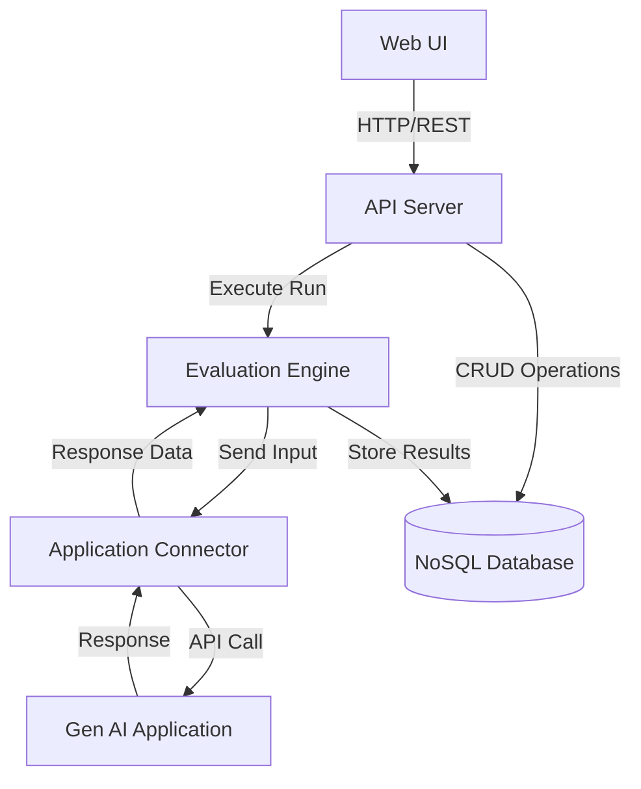
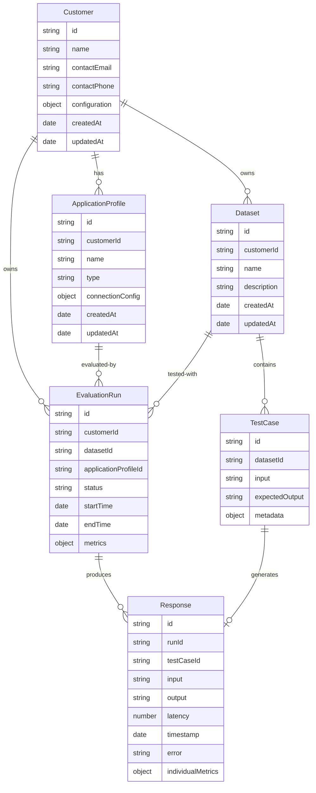

# Design Document: Gen AI Evaluation Platform

## Overview

The Gen AI Evaluation Platform is a multi-tenant web-based system that provides a generic framework for evaluating generative AI applications. The platform follows a three-tier architecture with a web frontend, REST API backend, and NoSQL database layer with complete tenant isolation. The design emphasizes flexibility to support any type of gen AI application through a plugin-based integration model, comprehensive metric evaluation, scalable data storage, and secure multi-tenancy.

The system enables:
- **Admins** to manage customers and define application profiles for each customer
- **Users** within a customer organization to create and manage test datasets
- **Users** to execute evaluation runs against their customer's application profiles
- **Users** to calculate performance metrics (accuracy, relevance, latency) on responses
- **Users** to view and analyze results through an interactive web dashboard with complete data isolation

**Multi-Tenancy Model:**
- Each **Customer** represents a tenant organization with complete data isolation
- **Application Profiles** are customer-specific configurations of gen AI applications
- All datasets, evaluation runs, and results are scoped to a customer
- Database-level isolation ensures no cross-tenant data access

## Architecture

### System Components

The platform consists of five primary components:

1. **Web UI (Frontend)**: React-based single-page application providing the user interface
2. **API Server (Backend)**: RESTful API service handling business logic and orchestration
3. **Application Connector**: Plugin-based system for integrating with various gen AI applications
4. **Evaluation Engine**: Component responsible for executing test runs and calculating metrics
5. **Data Layer**: MongoDB Community Edition (open-source) for persistent storage

### Component Interactions



### Technology Stack

- **Frontend**: React, TypeScript, Material-UI
- **Backend**: Python, FastAPI
- **Database**: MongoDB Community Edition (open-source NoSQL database)
- **Application Integration**: Plugin architecture supporting HTTP/REST, WebSocket, gRPC
- **Metrics**: Custom evaluation algorithms + optional LLM-based evaluation
- **Container Runtime**: Finch (Docker alternative for macOS) - lightweight, open-source container runtime (https://runfinch.com/)

## Components and Interfaces

### 1. Web UI Component

**Responsibilities:**
- Render user interface for all platform features
- Handle user interactions and form submissions
- Display evaluation results and metrics
- Provide navigation between datasets, applications, and runs

**Key Views:**
- Dashboard: Overview of recent runs and summary statistics (filtered by customer context)
- Admin Panel: Manage customers and application profiles (admin only)
- Customers View: List and manage customer organizations (admin only)
- Application Profiles View: List and manage application profiles for customers (admin only)
- Datasets View: List, create, edit, and delete datasets (scoped to user's customer)
- Runs View: Initiate evaluation runs and view execution status (scoped to user's customer)
- Results View: Display detailed results with metrics and comparisons (scoped to user's customer)

**Interface to API Server:**
```python
from typing import List, Optional, Dict, Any
from pydantic import BaseModel

class Customer(BaseModel):
    id: str
    name: str
    contact_email: str
    contact_phone: Optional[str] = None
    configuration: Optional[Dict[str, Any]] = None
    created_at: datetime
    updated_at: datetime

class ApplicationProfile(BaseModel):
    id: str
    customer_id: str
    name: str
    type: str
    connection_config: Dict[str, Any]
    created_at: datetime
    updated_at: datetime

class Dataset(BaseModel):
    id: str
    customer_id: str
    name: str
    description: str
    test_cases: List['TestCase']
    created_at: datetime
    updated_at: datetime

class TestCase(BaseModel):
    id: str
    input: str
    expected_output: Optional[str] = None
    metadata: Optional[Dict[str, Any]] = None

class EvaluationRun(BaseModel):
    id: str
    customer_id: str
    dataset_id: str
    application_profile_id: str
    status: str
    start_time: datetime
    end_time: Optional[datetime] = None
    responses: List['Response']
    metrics: Optional['AggregatedMetrics'] = None

class APIClient:
    """Frontend API client for communicating with Python backend"""
    
    # Customer operations (admin only)
    async def create_customer(self, name: str, contact_email: str, **kwargs) -> Customer: ...
    async def get_customers(self) -> List[Customer]: ...
    async def get_customer(self, id: str) -> Customer: ...
    async def update_customer(self, id: str, updates: Dict[str, Any]) -> Customer: ...
    async def delete_customer(self, id: str) -> None: ...
    
    # Application profile operations (admin only)
    async def create_application_profile(self, customer_id: str, config: Dict[str, Any]) -> ApplicationProfile: ...
    async def get_application_profiles(self, customer_id: Optional[str] = None) -> List[ApplicationProfile]: ...
    async def get_application_profile(self, id: str) -> ApplicationProfile: ...
    async def update_application_profile(self, id: str, updates: Dict[str, Any]) -> ApplicationProfile: ...
    async def delete_application_profile(self, id: str) -> None: ...
    
    # Dataset operations (scoped to user's customer)
    async def create_dataset(self, name: str, description: str) -> Dataset: ...
    async def get_datasets(self) -> List[Dataset]: ...
    async def get_dataset(self, id: str) -> Dataset: ...
    async def update_dataset(self, id: str, updates: Dict[str, Any]) -> Dataset: ...
    async def delete_dataset(self, id: str) -> None: ...
    
    # Test case operations
    async def add_test_case(self, dataset_id: str, test_case: TestCase) -> TestCase: ...
    async def update_test_case(self, dataset_id: str, test_case_id: str, updates: Dict[str, Any]) -> TestCase: ...
    async def delete_test_case(self, dataset_id: str, test_case_id: str) -> None: ...
    
    # Evaluation operations (scoped to user's customer)
    async def start_evaluation_run(self, dataset_id: str, application_profile_id: str) -> EvaluationRun: ...
    async def get_evaluation_runs(self) -> List[EvaluationRun]: ...
    async def get_evaluation_run(self, id: str) -> Dict[str, Any]: ...
    async def compare_runs(self, run_ids: List[str]) -> Dict[str, Any]: ...
```

### 2. API Server Component

**Responsibilities:**
- Expose REST API endpoints for all platform operations
- Validate incoming requests
- Orchestrate operations across components
- Handle authentication and authorization with customer context
- Enforce tenant isolation at API level
- Manage database connections

**REST API Endpoints:**

```
# Customer Management (Admin only)
POST   /api/customers                   # Create customer
GET    /api/customers                   # List all customers
GET    /api/customers/:id               # Get customer details
PUT    /api/customers/:id               # Update customer
DELETE /api/customers/:id               # Delete customer

# Application Profile Management (Admin only)
POST   /api/customers/:customerId/application-profiles  # Create application profile
GET    /api/customers/:customerId/application-profiles  # List customer's profiles
GET    /api/application-profiles/:id    # Get profile details
PUT    /api/application-profiles/:id    # Update profile
DELETE /api/application-profiles/:id    # Delete profile

# Dataset Management (User - scoped to their customer)
POST   /api/datasets                    # Create dataset
GET    /api/datasets                    # List datasets (filtered by customer)
GET    /api/datasets/:id                # Get dataset details
PUT    /api/datasets/:id                # Update dataset
DELETE /api/datasets/:id                # Delete dataset
POST   /api/datasets/:id/test-cases     # Add test case
PUT    /api/datasets/:id/test-cases/:tcId  # Update test case
DELETE /api/datasets/:id/test-cases/:tcId  # Delete test case

# Evaluation Execution (User - scoped to their customer)
POST   /api/evaluations                 # Start evaluation run
GET    /api/evaluations                 # List evaluation runs (filtered by customer)
GET    /api/evaluations/:id             # Get run details
POST   /api/evaluations/compare         # Compare multiple runs

# Health Check
GET    /api/health                      # System health status
```

**Interface to Evaluation Engine:**
```python
from typing import Dict, Any

class EvaluationEngine:
    """Core evaluation engine for executing test runs"""
    
    async def execute_run(self, customer_id: str, dataset_id: str, application_profile_id: str) -> EvaluationRun: ...
    async def get_run_status(self, run_id: str) -> Dict[str, Any]: ...
    async def calculate_metrics(self, run_id: str) -> Dict[str, Any]: ...
```

### 3. Application Connector Component

**Responsibilities:**
- Provide generic interface for connecting to gen AI applications
- Support multiple connection protocols (HTTP, WebSocket, gRPC)
- Handle request/response serialization
- Manage connection timeouts and retries
- Abstract application-specific details

**Plugin Architecture:**
```python
from abc import ABC, abstractmethod
from typing import Dict, Any, Optional
from dataclasses import dataclass

@dataclass
class ApplicationResponse:
    """Response from a gen AI application"""
    output: str
    latency: float
    metadata: Optional[Dict[str, Any]] = None
    error: Optional[str] = None

@dataclass
class ConnectionConfig:
    """Configuration for connecting to an application"""
    endpoint: str
    authentication: Optional[Dict[str, Any]] = None
    timeout: int = 30
    retries: int = 3
    custom_headers: Optional[Dict[str, str]] = None

class ApplicationPlugin(ABC):
    """Base class for application connector plugins"""
    
    def __init__(self, plugin_type: str):
        self.type = plugin_type
    
    @abstractmethod
    async def connect(self, config: ConnectionConfig) -> None:
        """Establish connection to the application"""
        pass
    
    @abstractmethod
    async def disconnect(self) -> None:
        """Close connection to the application"""
        pass
    
    @abstractmethod
    async def send_input(self, input_text: str) -> ApplicationResponse:
        """Send input to application and get response"""
        pass
    
    @abstractmethod
    def is_connected(self) -> bool:
        """Check if connection is active"""
        pass
```

**Built-in Plugins:**
- HTTP/REST Plugin: For standard REST API applications
- WebSocket Plugin: For real-time streaming applications
- Custom Plugin: User-defined integration logic

### 4. Evaluation Engine Component

**Responsibilities:**
- Execute evaluation runs by iterating through test cases
- Send inputs to gen AI applications via Application Connector
- Capture responses and measure latency
- Calculate metrics on responses
- Store results in database
- Handle errors and partial failures

**Core Algorithm:**
```python
from typing import List
from datetime import datetime

class EvaluationEngine:
    """Engine for executing evaluation runs"""
    
    async def execute_run(self, customer_id: str, dataset_id: str, application_profile_id: str) -> EvaluationRun:
        """
        Execute an evaluation run
        
        Steps:
        1. Verify customer_id matches for dataset and application profile
        2. Load dataset and application profile config from database
        3. Create evaluation run record with customer_id
        4. For each test case:
           a. Send input to application via connector
           b. Capture response and latency
           c. Store response in database
        5. Calculate metrics for all responses
        6. Update run status to completed
        7. Return evaluation run
        """
        # Implementation details
        pass
```

**Metrics Calculation:**
```python
from typing import List, Dict, Any
from dataclasses import dataclass

@dataclass
class AggregatedMetrics:
    """Aggregated metrics for an evaluation run"""
    average_accuracy: float
    average_relevance: float
    average_latency: float
    median_latency: float
    p95_latency: float
    success_rate: float
    total_test_cases: int
    failed_test_cases: int

class MetricsCalculator:
    """Calculator for evaluation metrics"""
    
    def calculate_accuracy(self, response: str, expected_output: str) -> float:
        """Calculate accuracy score comparing response to expected output"""
        pass
    
    def calculate_relevance(self, input_text: str, response: str) -> float:
        """Calculate relevance score of response to input"""
        pass
    
    def calculate_latency(self, start_time: float, end_time: float) -> float:
        """Calculate latency in milliseconds"""
        pass
    
    def aggregate_metrics(self, responses: List[Dict[str, Any]]) -> AggregatedMetrics:
        """Aggregate metrics across all responses"""
        pass
```

### 5. Data Layer Component

**Responsibilities:**
- Persist all platform data in MongoDB Community Edition
- Provide data access methods
- Handle database connections and errors
- Ensure data consistency

**Data Models:**

```python
from typing import List, Optional, Dict, Any
from datetime import datetime
from pydantic import BaseModel, Field

class Customer(BaseModel):
    """Tenant organization"""
    id: str
    name: str
    contact_email: str
    contact_phone: Optional[str] = None
    configuration: Optional[Dict[str, Any]] = None
    created_at: datetime
    updated_at: datetime

class ApplicationProfile(BaseModel):
    """Customer-specific gen AI application configuration"""
    id: str
    customer_id: str  # Tenant isolation
    name: str
    type: str  # 'chatbot', 'rag', 'agent', 'workflow', etc.
    connection_config: 'ConnectionConfig'
    created_at: datetime
    updated_at: datetime

class TestCase(BaseModel):
    """Individual test case within a dataset"""
    id: str
    input: str
    expected_output: Optional[str] = None
    metadata: Optional[Dict[str, Any]] = None

class Dataset(BaseModel):
    """Collection of test cases for evaluation"""
    id: str
    customer_id: str  # Tenant isolation
    name: str
    description: str
    test_cases: List[TestCase] = Field(default_factory=list)
    created_at: datetime
    updated_at: datetime

class ConnectionConfig(BaseModel):
    """Configuration for connecting to a gen AI application"""
    endpoint: str
    authentication: Optional[Dict[str, Any]] = None
    timeout: int = 30
    retries: int = 3
    custom_headers: Optional[Dict[str, str]] = None

class IndividualMetrics(BaseModel):
    """Metrics for a single response"""
    accuracy: Optional[float] = None
    relevance: Optional[float] = None

class Response(BaseModel):
    """Response from gen AI application for a test case"""
    test_case_id: str
    input: str
    output: str
    latency: float
    timestamp: datetime
    error: Optional[str] = None
    individual_metrics: Optional[IndividualMetrics] = None

class AggregatedMetrics(BaseModel):
    """Aggregated metrics for an evaluation run"""
    average_accuracy: float
    average_relevance: float
    average_latency: float
    median_latency: float
    p95_latency: float
    success_rate: float
    total_test_cases: int
    failed_test_cases: int

class EvaluationRun(BaseModel):
    """Evaluation run execution record"""
    id: str
    customer_id: str  # Tenant isolation
    dataset_id: str
    application_profile_id: str
    status: str  # 'pending', 'running', 'completed', 'failed'
    start_time: datetime
    end_time: Optional[datetime] = None
    responses: List[Response] = Field(default_factory=list)
    metrics: Optional[AggregatedMetrics] = None
```

**Database Operations:**
```python
from typing import List, Optional, Dict, Any
from abc import ABC, abstractmethod

class DataRepository(ABC):
    """Abstract repository for data persistence operations with tenant isolation"""
    
    # Customer operations
    @abstractmethod
    async def create_customer(self, customer: Customer) -> Customer:
        """Create a new customer"""
        pass
    
    @abstractmethod
    async def get_customers(self) -> List[Customer]:
        """Get all customers"""
        pass
    
    @abstractmethod
    async def get_customer_by_id(self, id: str) -> Optional[Customer]:
        """Get customer by ID"""
        pass
    
    @abstractmethod
    async def update_customer(self, id: str, updates: Dict[str, Any]) -> Customer:
        """Update customer"""
        pass
    
    @abstractmethod
    async def delete_customer(self, id: str) -> None:
        """Delete customer"""
        pass
    
    # Application profile operations
    @abstractmethod
    async def create_application_profile(self, profile: ApplicationProfile) -> ApplicationProfile:
        """Create a new application profile"""
        pass
    
    @abstractmethod
    async def get_application_profiles(self, customer_id: Optional[str] = None) -> List[ApplicationProfile]:
        """Get application profiles, optionally filtered by customer"""
        pass
    
    @abstractmethod
    async def get_application_profile_by_id(self, id: str) -> Optional[ApplicationProfile]:
        """Get application profile by ID"""
        pass
    
    @abstractmethod
    async def update_application_profile(self, id: str, updates: Dict[str, Any]) -> ApplicationProfile:
        """Update application profile"""
        pass
    
    @abstractmethod
    async def delete_application_profile(self, id: str) -> None:
        """Delete application profile"""
        pass
    
    # Dataset operations (tenant-scoped)
    @abstractmethod
    async def create_dataset(self, dataset: Dataset) -> Dataset:
        """Create a new dataset"""
        pass
    
    @abstractmethod
    async def get_datasets(self, customer_id: str) -> List[Dataset]:
        """Get all datasets for a customer"""
        pass
    
    @abstractmethod
    async def get_dataset_by_id(self, id: str, customer_id: str) -> Optional[Dataset]:
        """Get dataset by ID (with tenant check)"""
        pass
    
    @abstractmethod
    async def update_dataset(self, id: str, customer_id: str, updates: Dict[str, Any]) -> Dataset:
        """Update dataset (with tenant check)"""
        pass
    
    @abstractmethod
    async def delete_dataset(self, id: str, customer_id: str) -> None:
        """Delete dataset (with tenant check)"""
        pass
    
    # Evaluation run operations (tenant-scoped)
    @abstractmethod
    async def create_evaluation_run(self, run: EvaluationRun) -> EvaluationRun:
        """Create a new evaluation run"""
        pass
    
    @abstractmethod
    async def get_evaluation_runs(self, customer_id: str) -> List[EvaluationRun]:
        """Get all evaluation runs for a customer"""
        pass
    
    @abstractmethod
    async def get_evaluation_run_by_id(self, id: str, customer_id: str) -> Optional[EvaluationRun]:
        """Get evaluation run by ID (with tenant check)"""
        pass
    
    @abstractmethod
    async def update_evaluation_run(self, id: str, customer_id: str, updates: Dict[str, Any]) -> EvaluationRun:
        """Update evaluation run (with tenant check)"""
        pass
    
    # Response operations
    @abstractmethod
    async def add_response(self, run_id: str, response: Response) -> None:
        """Add response to evaluation run"""
        pass
    
    @abstractmethod
    async def get_responses(self, run_id: str) -> List[Response]:
        """Get all responses for evaluation run"""
        pass
```

## Data Models

### Entity Relationships



### MongoDB Collections

**customers collection:**
```json
{
  "_id": "ObjectId",
  "name": "string",
  "contactEmail": "string",
  "contactPhone": "string",
  "configuration": {},
  "createdAt": "ISODate",
  "updatedAt": "ISODate"
}
```

**applicationProfiles collection:**
```json
{
  "_id": "ObjectId",
  "customerId": "string",
  "name": "string",
  "type": "string",
  "connectionConfig": {
    "endpoint": "string",
    "authentication": {},
    "timeout": "number",
    "retries": "number"
  },
  "createdAt": "ISODate",
  "updatedAt": "ISODate"
}
```

**datasets collection:**
```json
{
  "_id": "ObjectId",
  "customerId": "string",
  "name": "string",
  "description": "string",
  "testCases": [
    {
      "id": "string",
      "input": "string",
      "expectedOutput": "string",
      "metadata": {}
    }
  ],
  "createdAt": "ISODate",
  "updatedAt": "ISODate"
}
```

**evaluationRuns collection:**
```json
{
  "_id": "ObjectId",
  "customerId": "string",
  "datasetId": "string",
  "applicationProfileId": "string",
  "status": "string",
  "startTime": "ISODate",
  "endTime": "ISODate",
  "responses": [
    {
      "testCaseId": "string",
      "input": "string",
      "output": "string",
      "latency": "number",
      "timestamp": "ISODate",
      "error": "string",
      "individualMetrics": {
        "accuracy": "number",
        "relevance": "number"
      }
    }
  ],
  "metrics": {
    "averageAccuracy": "number",
    "averageRelevance": "number",
    "averageLatency": "number",
    "medianLatency": "number",
    "p95Latency": "number",
    "successRate": "number",
    "totalTestCases": "number",
    "failedTestCases": "number"
  }
}
```

**Database Indexes for Multi-Tenancy:**
```javascript
// Ensure efficient tenant-scoped queries
db.applicationProfiles.createIndex({ "customerId": 1 })
db.datasets.createIndex({ "customerId": 1 })
db.evaluationRuns.createIndex({ "customerId": 1 })

// Compound indexes for common queries
db.evaluationRuns.createIndex({ "customerId": 1, "status": 1 })
db.evaluationRuns.createIndex({ "customerId": 1, "startTime": -1 })
```


## Correctness Properties

*A property is a characteristic or behavior that should hold true across all valid executions of a system—essentially, a formal statement about what the system should do. Properties serve as the bridge between human-readable specifications and machine-verifiable correctness guarantees.*

### Property 1: Dataset persistence round-trip

*For any* dataset with test cases, creating the dataset then retrieving it should return an equivalent dataset with all test cases intact.

**Validates: Requirements 1.2, 1.8, 6.2**

### Property 2: Test case modification preserves dataset

*For any* dataset and any test case within it, modifying the test case should update only that test case while leaving all other test cases in the dataset unchanged.

**Validates: Requirements 1.3**

### Property 3: Deletion removes entity completely

*For any* entity (dataset, test case, or application), after deletion, attempting to retrieve that entity should return not found.

**Validates: Requirements 1.4, 1.5**

### Property 4: List operations return all entities

*For any* collection of created entities (datasets or applications), listing those entities should return all of them with correct metadata.

**Validates: Requirements 1.6, 1.7**

### Property 5: Application configuration persistence round-trip

*For any* application configuration, registering the application then retrieving it should return an equivalent configuration.

**Validates: Requirements 2.2, 2.6, 6.3**

### Property 6: Application type support

*For any* valid application type (chatbot, RAG, agent, workflow), registering an application of that type should succeed.

**Validates: Requirements 2.3**

### Property 7: Request-response capture

*For any* input sent to a gen AI application, the platform should capture a response (either successful output or error).

**Validates: Requirements 2.4**

### Property 8: Connection error handling

*For any* application connection failure, the platform should return an error message without crashing and should not execute the evaluation.

**Validates: Requirements 2.5, 7.1**

### Property 9: Evaluation executes all test cases

*For any* dataset and application, initiating an evaluation run should execute all test cases in the dataset.

**Validates: Requirements 3.1, 3.2**

### Property 10: Response metadata completeness

*For any* captured response, it should include a timestamp, latency measurement, and either output or error.

**Validates: Requirements 3.3, 3.4**

### Property 11: Partial failure resilience

*For any* evaluation run where some test cases fail, the platform should execute all remaining test cases and record which ones failed.

**Validates: Requirements 3.5, 7.3**

### Property 12: Evaluation run persistence round-trip

*For any* evaluation run with responses, storing the run then retrieving it should return an equivalent run with all responses and timestamps intact.

**Validates: Requirements 3.6, 6.4**

### Property 13: Run completion status update

*For any* evaluation run, when all test cases complete execution, the run status should be updated to completed.

**Validates: Requirements 3.7**

### Property 14: Metrics calculation completeness

*For any* completed evaluation run, all responses should have calculated metrics including accuracy (when expected output exists), relevance, and latency.

**Validates: Requirements 4.1, 4.2, 4.3, 4.4, 4.5**

### Property 15: Metrics aggregation correctness

*For any* evaluation run, the aggregated run-level metrics should be correctly calculated from individual response metrics (e.g., average latency equals sum of latencies divided by count).

**Validates: Requirements 4.6**

### Property 16: Metrics persistence round-trip

*For any* evaluation run with calculated metrics, storing the metrics then retrieving them should return equivalent metric values.

**Validates: Requirements 4.7, 6.5**

### Property 17: Run comparison returns all specified runs

*For any* set of evaluation run IDs, requesting a comparison should return metrics for all specified runs.

**Validates: Requirements 5.4**

### Property 18: Filtering returns only matching results

*For any* filter criteria applied to evaluation results, all returned results should match the filter criteria and no matching results should be excluded.

**Validates: Requirements 5.6**

### Property 19: Sorting maintains order

*For any* sort criteria applied to evaluation results, the returned results should be ordered according to the criteria.

**Validates: Requirements 5.6**

### Property 20: Database operation error handling

*For any* database operation failure, the platform should return a descriptive error message and not corrupt existing data.

**Validates: Requirements 6.7, 7.2**

### Property 21: Input validation rejects invalid data

*For any* invalid user input (empty strings, malformed data, missing required fields), the platform should reject the input with a specific validation error message.

**Validates: Requirements 7.4, 7.5**

## Error Handling

### Error Categories

The platform handles four primary categories of errors:

1. **Validation Errors**: Invalid user input (empty fields, malformed data)
2. **Connection Errors**: Failures connecting to gen AI applications
3. **Database Errors**: Failures in NoSQL database operations
4. **Execution Errors**: Failures during evaluation run execution

### Error Handling Strategy

**Validation Errors:**
- Validate all inputs before processing
- Return HTTP 400 with specific error messages
- Include field-level validation details
- Example: "Dataset name is required and must be 1-100 characters"

**Connection Errors:**
- Catch connection failures to gen AI applications
- Log error details for debugging
- Return error in response object with descriptive message
- Mark test case as failed but continue with remaining test cases
- Example: "Failed to connect to application: Connection timeout after 30s"

**Database Errors:**
- Catch all database operation failures
- Log error with stack trace
- Return HTTP 500 with user-friendly message
- Prevent data corruption by using transactions where applicable
- Example: "Failed to save dataset: Database connection lost"

**Execution Errors:**
- Catch errors during evaluation run execution
- Record error for specific test case
- Continue executing remaining test cases
- Update run status to completed with partial failures
- Include error count in run metrics
- Example: "Test case 3 failed: Application returned HTTP 500"

### Error Response Format

```python
from datetime import datetime
from typing import Optional, Any
from pydantic import BaseModel

class ErrorDetail(BaseModel):
    """Error response structure"""
    code: str              # Machine-readable error code
    message: str           # Human-readable error message
    details: Optional[Any] = None  # Additional error context
    timestamp: datetime    # When error occurred

class ErrorResponse(BaseModel):
    """API error response"""
    error: ErrorDetail
```

### Graceful Degradation

- Database connection failures prevent write operations but allow read-only mode
- Application connection failures fail individual test cases but not entire runs
- Metric calculation failures record error but don't prevent run completion
- UI errors display error messages but maintain application state

## Testing Strategy

### Dual Testing Approach

The platform will use both unit testing and property-based testing to ensure comprehensive coverage:

- **Unit tests**: Verify specific examples, edge cases, and error conditions
- **Property tests**: Verify universal properties across all inputs

Together, these approaches provide comprehensive coverage where unit tests catch concrete bugs and property tests verify general correctness.

### Unit Testing

**Framework**: 
- **Frontend**: Jest + React Testing Library
- **Backend**: pytest

**Unit Test Focus Areas:**
- Specific examples demonstrating correct behavior
- Edge cases (empty datasets, single test case, large datasets)
- Error conditions (network failures, invalid data, database errors)
- Integration points between components
- UI component rendering and interactions

**Example Unit Tests:**
- Creating a dataset with specific name and description
- Adding a test case with empty expected output
- Handling application timeout errors
- Calculating metrics for a run with one test case
- Displaying error message when database connection fails

**Unit Test Organization:**
```
backend/
  tests/
    unit/
      test_api_datasets.py
      test_api_applications.py
      test_api_evaluations.py
      test_evaluation_engine.py
      test_metrics_calculator.py
      test_http_plugin.py
      test_websocket_plugin.py

frontend/
  tests/
    unit/
      DatasetView.test.tsx
      ResultsView.test.tsx
      ApplicationView.test.tsx
```

### Property-Based Testing

**Framework**: 
- **Backend**: Hypothesis (Python property-based testing library)
- **Frontend**: fast-check (for TypeScript/JavaScript)

**Configuration:**
- Minimum 100 iterations per property test
- Each test tagged with feature name and property number
- Tag format: `Feature: gen-ai-eval-platform, Property {N}: {property text}`

**Property Test Implementation:**
- Each correctness property from the design document must be implemented as a single property-based test
- Tests generate random valid inputs to verify properties hold universally
- Tests should cover the full range of valid input space

**Example Property Test (Python/Backend):**
```python
from hypothesis import given, strategies as st
import pytest

# Feature: gen-ai-eval-platform, Property 1: Dataset persistence round-trip
@given(
    name=st.text(min_size=1, max_size=100),
    description=st.text(max_size=500),
    test_cases=st.lists(
        st.fixed_dictionaries({
            'input': st.text(min_size=1),
            'expected_output': st.one_of(st.none(), st.text())
        })
    )
)
@pytest.mark.asyncio
async def test_dataset_persistence_round_trip(name, description, test_cases):
    """Property: Dataset persistence round-trip"""
    dataset = Dataset(name=name, description=description, test_cases=test_cases)
    created = await data_repository.create_dataset(dataset)
    retrieved = await data_repository.get_dataset_by_id(created.id)
    
    assert retrieved is not None
    assert retrieved.name == dataset.name
    assert retrieved.description == dataset.description
    assert len(retrieved.test_cases) == len(dataset.test_cases)
```

**Property Test Organization:**
```
backend/
  tests/
    properties/
      test_dataset_properties.py      # Properties 1-4
      test_application_properties.py  # Properties 5-8
      test_evaluation_properties.py   # Properties 9-13
      test_metrics_properties.py      # Properties 14-16
      test_query_properties.py        # Properties 17-19
      test_error_properties.py        # Properties 20-21

frontend/
  tests/
    properties/
      ui-properties.test.ts           # UI-specific properties
```

### Integration Testing

**Focus**: End-to-end workflows across components

**Key Integration Tests:**
- Complete evaluation run workflow (create dataset → register app → run evaluation → view results)
- Multi-user scenarios (concurrent dataset creation, parallel evaluation runs)
- Database connection lifecycle (startup, reconnection, failure recovery)
- Application connector plugin lifecycle (connect, execute, disconnect)

### Test Coverage Goals

- Unit test coverage: >80% for business logic
- Property test coverage: 100% of correctness properties
- Integration test coverage: All critical user workflows
- UI component coverage: >70% for interactive components

### Continuous Testing

- Run unit tests on every commit
- Run property tests on every pull request
- Run integration tests nightly
- Monitor test execution time and optimize slow tests
