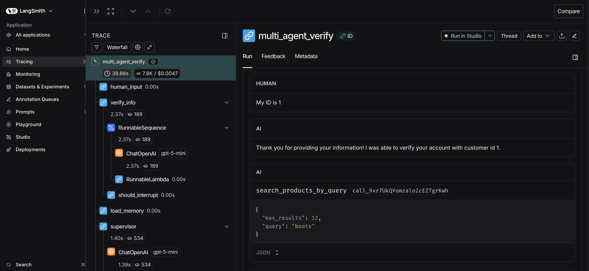

# E-Commerce Shopping Agent

An intelligent shopping assistant powered by **LangGraph**, **OpenAI**, and **OpenSearch** with neural search capabilities.

## ✨ Features

- **Multi-Agent Architecture**: Supervisor agent routing to specialized subagents (product catalog, invoices)
- **Semantic Product Search**: AI-powered neural search across 2,465+ products using OpenSearch
- **Personalized Recommendations**: Customer memory integration for tailored product suggestions
- **Natural Language Queries**: "Find me a backpack for hiking" or "Show electronics under $100"
- **Hybrid Search**: Combines neural embeddings with BM25 keyword matching
- **Modern Architecture**: Conditional routing pattern following AWS best practices

## 🛠️ Technology Stack

- **LLM**: OpenAI (GPT-4o or GPT-4o-mini or gpt-5-mini)
- **Search**: OpenSearch 3.1+ with ML Commons neural search
- **Framework**: LangGraph for multi-agent orchestration
- **Embeddings**: sentence-transformers/msmarco-distilbert-base-tas-b (768-dim)

## 📋 Prerequisites

- Python 3.13+
- Docker (for OpenSearch)
- OpenAI API key
- 4GB RAM minimum

## 🚀 Quick Start

### 1. Clone and Install

```bash
git clone <repository-url>
cd langchain/shopping-agent

# Install dependencies
uv sync

# activate virtual environment
source .venv/bin/activate  # On Windows: .venv\Scripts\activate
```

### 2. Configure Environment

```bash
# Copy environment template
cp .env.example .env

# Edit .env and add your OpenAI API key
OPENAI_API_KEY="sk-your-api-key-here"
OPENAI_MODEL="gpt-4o"  # or "gpt-4o-mini" for lower cost
```

### 3. Setup OpenSearch

#### Start OpenSearch with Docker:

```bash
docker-compose up -d
```

**Configure OpenSearch in .env:**

```bash
OPENSEARCH_HOST="localhost"
OPENSEARCH_PORT="9200"
OPENSEARCH_INDEX_PRODUCTS="shopping_products"
```

#### Setup ML model and load products:

```bash
# Setup neural search model (~5 minutes)
python scripts/setup_opensearch.py

# Load product catalog (~3 minutes)
python scripts/load_products_to_opensearch.py

# Optional: Register Bedrock LLM for enhanced memory features (~2 minutes)
# Requires: AWS credentials with Bedrock access in .env
python scripts/register_bedrock_llm.py

# Setup agentic memory container for customer preferences (~1 minute)
python scripts/setup_opensearch_memory_container.py
```

**After running setup scripts:**

- Copy the `OPENSEARCH_MEMORY_CONTAINER_ID` from memory setup output
- If you ran Bedrock LLM setup, copy the `OPENSEARCH_LLM_MODEL_ID` as well
- Add both to your `.env` file

### 4. Run the Agent

#### Option A: LangGraph Studio (Recommended)

```bash
langgraph dev

# This starts:
# - Local API server at http://localhost:8123
# - LangGraph Studio UI for visual debugging
# - Hot-reloading during development
```

#### Option B: Python Script

```bash
python -m agents.agent
```

#### Option C: Run Tests

```bash
# Test OpenSearch product search integration
python scripts/test_opensearch_integration.py

# Test OpenSearch agentic memory operations
python scripts/test_opensearch_memory.py
```

## 🏗️ Architecture

The shopping agent uses a multi-agent architecture with conditional routing:

```text
User Query
    ↓
Verify Customer ID (extract or prompt)
    ↓
Load Customer Memory (OpenSearch agentic memory)
    ↓
Supervisor Router (LLM routing decision)
    ├─→ OpenSearch Agent
    │   ├─ Semantic product search
    │   ├─ Category/price filtering
    │   ├─ Personalized recommendations
    │   └─ Product details
    │
    └─→ Invoice Agent
        ├─ Order history
        ├─ Billing information
        └─ Purchase tracking
    ↓
Update Customer Memory (persist to OpenSearch)
    ↓
Response to User
```

### Key Components

- **Supervisor Router**: LLM-based routing to specialized agents
- **OpenSearch Agent**: Product catalog search and recommendations
- **Invoice Agent**: Order history and billing queries
- **Customer Memory**: OpenSearch agentic memory for personalized preference tracking
- **Conditional Routing**: Modern graph-based routing (no tool-based nesting)

## 📊 Example Queries

```python
# Product search
"I need a backpack for hiking"
"Show me electronics under $100"
"What are your featured products?"

# Personalized recommendations
"I love outdoor activities, what would you recommend?"
"Find me a gift for someone who enjoys cooking"

# Order history
"Show me my recent purchases"
"What did I order last month?"

# Combined queries
"Show my past orders and recommend similar products"
```

## Viewing Queries 

LangSmith is integrated into this project and allows you to view the execution path of the shopping agent. This gives you an understanding of why the agent behaved how it did.

To view traces, set the LangSmith environment variables in your .env file:
    - LANGSMITH_API_KEY=""
    - LANGSMITH_ENDPOINT="https://api.smith.langchain.com"
    - LANGSMITH_TRACING="true"
    - LANGSMITH_PROJECT="aws-shopping-agent"

You can then log into [LangSmith](https://smith.langchain.com) and view the traces in the "aws-shopping-agent" project.




## 🧪 Testing

Run the integration test suite:

```bash
python scripts/test_opensearch_integration.py
```

This tests:

- ✅ OpenSearch connectivity
- ✅ Neural search functionality
- ✅ Multi-agent routing
- ✅ Authentication flow
- ✅ Product recommendations
- ✅ Memory management

## 📁 Project Structure

```text
langchain/shopping-agent/
├── agents/
│   ├── agent.py                    # Main graph orchestration
│   ├── subagents.py                # Specialized agents
│   ├── tools.py                    # OpenSearch and database tools
│   ├── opensearch_client.py        # OpenSearch connection utilities
│   ├── opensearch_memory_client.py # Agentic memory client
│   ├── prompts.py                  # System prompts
│   └── utils.py                    # LLM initialization
├── scripts/
│   ├── setup_opensearch.py                    # Setup neural search
│   ├── setup_opensearch_memory_container.py   # Setup agentic memory
│   ├── load_products_to_opensearch.py         # Load product catalog
│   ├── test_opensearch_integration.py         # Test product search
│   └── test_opensearch_memory.py              # Test memory operations
├── docs/
│   ├── SETUP.md                    # Complete setup guide
│   ├── BEDROCK_LIMITATION.md
│   ├── OPENSEARCH_INTEGRATION.md
│   └── FINAL_STATUS.md
├── .env                            # Configuration
├── docker-compose.yml              # OpenSearch setup
└── README.md
```

## 🔧 Configuration

### OpenAI Settings

```bash
OPENAI_API_KEY="sk-..."       # Required
OPENAI_MODEL="gpt-4o"         # or "gpt-4o-mini"
```

### OpenSearch Settings

```bash
OPENSEARCH_HOST="localhost"
OPENSEARCH_PORT="9200"
OPENSEARCH_INDEX_PRODUCTS="shopping_products"
OPENSEARCH_MODEL_ID="<your-model-id>"

# Agentic Memory Configuration
OPENSEARCH_MEMORY_CONTAINER_ID="<your-memory-container-id>"
OPENSEARCH_LLM_MODEL_ID="<optional-llm-model-id>"
```

### LangSmith (Optional)

```bash
LANGSMITH_TRACING="true"
LANGSMITH_API_KEY="lsv2_..."
LANGSMITH_PROJECT="aws-shopping-agent"
```

## 🐛 Troubleshooting

### OpenSearch Connection Error

```bash
# Check if OpenSearch is running
docker ps

# Restart if needed
docker-compose restart
```

### No Products Found

```bash
# Load sample products
python scripts/load_products_to_opensearch.py
```

### OpenAI API Errors

```bash
# Verify API key is set
echo $OPENAI_API_KEY

## 💡 Key Features Explained

### Neural Search
Uses OpenSearch ML Commons with sentence transformers for semantic understanding:
```python
# Query: "backpack for hiking"
# Matches: "outdoor gear", "camping equipment", "trail essentials"
```

### Conditional Routing

Modern LangGraph pattern using conditional edges instead of tool-based subagent calls:

- Cleaner architecture
- Better message flow
- Matches AWS best practices
- More scalable

### Customer Memory with OpenSearch Agentic Memory

Persists customer preferences across sessions using OpenSearch's native agentic memory containers:

```python
# First conversation: "I love outdoor activities"
# Later: "What would you recommend?"
# Agent: Suggests hiking gear, camping equipment
```

**Key Features:**

- **Durable Storage**: Memories persist in OpenSearch, survive restarts
- **Semantic Search**: Find customers with similar preferences
- **LLM Integration**: Optional LLM-powered memory summarization
- **Scalable**: Handle millions of customer profiles
- **Production-Ready**: AWS OpenSearch Service compatible

**Reference**: [OpenSearch Agentic Memory Documentation](https://docs.opensearch.org/latest/ml-commons-plugin/agentic-memory/)

## 🔗 Resources

- **[LangChain Documentation](https://docs.langchain.com/oss/python/langchain/overview)** - Complete reference
- **[LangGraph Documentation](https://docs.langchain.com/oss/python/langgraph/overview)** - Graph framework
- **[LangGraph CLI](https://docs.langchain.com/langsmith/cli#langgraph-cli)** - Development tools
- **[LangChain Academy](https://academy.langchain.com/)** - Free video tutorials
- **[LangSmith](https://smith.langchain.com)** - Debugging and monitoring
