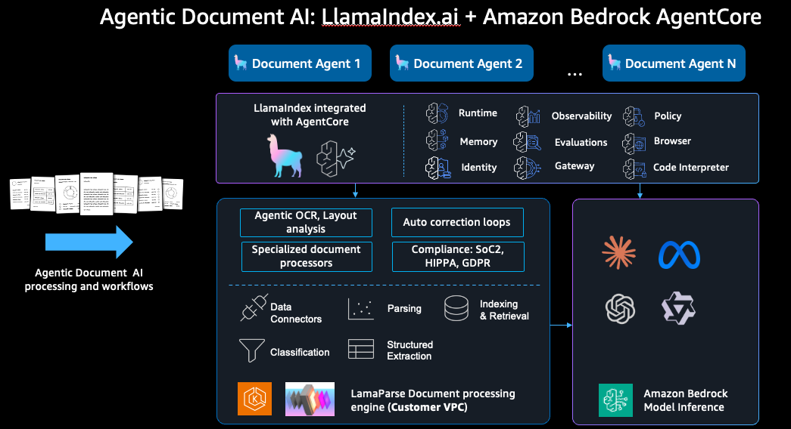

## LlamaIndex


LlamaIndex is a framework for building context-augmented generative AI applications with LLMs including agents and workflows.

## Agentic Document AI: LlamaIndex.ai + Amazon Bedrock AgentCore



This architecture demonstrates how LlamaIndex integrates with Amazon Bedrock AgentCore to enable agentic document AI processing and workflows. Key components include:

- **Document Agents** — Multiple specialized agents for document processing tasks
- **LlamaIndex integrated with AgentCore** — Provides Runtime, Memory, Identity, Observability, Evaluations, Gateway, Policy, Browser, and Code Interpreter capabilities
- **LamaParse Document Processing Engine** — Runs in the Customer VPC and provides:
  - Agentic OCR and Layout analysis
  - Auto correction loops
  - Specialized document processors
  - Compliance (SoC2, HIPPA, GDPR)
  - Data Connectors, Parsing, Indexing & Retrieval
  - Classification and Structured Extraction
- **Amazon Bedrock Model Inference** — Supports multiple foundation models for inference

## LlamaIndex Official Documentation

**Docs:** https://docs.llamaindex.ai/en/stable/

## LlamaIndex + AWS

### Importing LLMs from Amazon Bedrock

**Model IDs Supported:** https://docs.aws.amazon.com/bedrock/latest/userguide/models-supported.html

**LLM Configuration:** 
Boto3:
```
from llama_index.llms.bedrock import Bedrock

llm = Bedrock(
    model="amazon.titan-text-express-v1",
    aws_access_key_id="AWS Access Key ID to use",
    aws_secret_access_key="AWS Secret Access Key to use",
    aws_session_token="AWS Session Token to use",
    region_name="AWS Region to use, eg. us-east-1",
)

resp = llm.complete("Paul Graham is ")
```