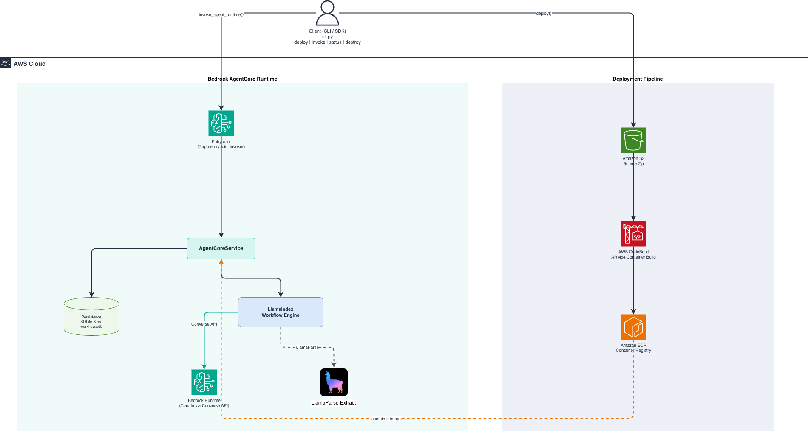

# KYC Document Verification — LlamaIndex Workflows on AWS Bedrock AgentCore

Deploy an AI-powered KYC (Know Your Customer) document verification agent to
**AWS Bedrock AgentCore** in minutes. This example shows how
[LlamaIndex Workflows](https://docs.llamaindex.ai/en/stable/understanding/workflows/)
running on AgentCore can automate real-world compliance tasks — extracting
structured data from identity documents and cross-validating them with Claude.

## What It Does

1. **Document Extraction** — Three identity documents (Government ID, Utility
   Bill, Bank Statement) are processed *in parallel* through
   [LlamaParse Extract](https://docs.llamaindex.ai/en/stable/llama_cloud/llama_extract/)
   to pull out structured fields (name, address, account details).
2. **Cross-Validation** — Claude (via Amazon Bedrock) compares names and addresses
   across all three documents, handling abbreviations, formatting differences,
   and name ordering.
3. **KYC Decision** — Returns a structured **PASS / REVIEW / FAIL** verdict
   with per-check reasoning.

```
  Government ID ─┐
  Utility Bill  ──┼─→ LlamaParse Extract (parallel) ─→ Claude Cross-Validation ─→ KYC Decision
  Bank Statement ─┘
```

## Project Structure

| File | Purpose |
|------|---------|
| `workflow.py` | KYC workflow — LlamaParse extraction + Claude validation |
| `cli.py` | CLI to deploy, invoke, monitor, and tear down the agent |
| `customer-iam-role.yaml` | CloudFormation template for required IAM roles |
| `pyproject.toml` | Dependencies and workflow registration |
| `sample_docs/` | Sample PDFs for testing (driver's license, utility bill, bank statement) |

## Prerequisites

- **Python 3.10+** with [uv](https://docs.astral.sh/uv/) (or pip)
- **AWS credentials** configured (`aws configure` or environment variables)
- **IAM roles** — deploy `customer-iam-role.yaml` to the target account (see below)
- **LlamaCloud API key** — set `LLAMA_CLOUD_API_KEY` in `.env`
- **Bedrock model access** — enable `us.anthropic.claude-sonnet-4-6` in your region

## Setup

### 1. Deploy IAM Roles

```bash
aws cloudformation deploy \
  --template-file customer-iam-role.yaml \
  --stack-name agentcore-kyc-iam \
  --capabilities CAPABILITY_NAMED_IAM \
  --region us-east-1
```

Note the output ARNs for `DeployRoleArn` and `ExecutionRoleArn`:

```bash
aws cloudformation describe-stacks \
  --stack-name agentcore-kyc-iam \
  --query 'Stacks[0].Outputs' \
  --output table
```

### 2. Configure Environment

```bash
# Create .env with your LlamaCloud API key
echo "LLAMA_CLOUD_API_KEY=llx-your-key-here" > .env

# Install dependencies
uv sync
```

### 3. Deploy to AgentCore

```bash
python cli.py deploy \
  --deployment-role <DeployRoleArn> \
  --execution-role <ExecutionRoleArn>
```

### 4. Run KYC Verification

```bash
python cli.py invoke \
  --gov-id sample_docs/drivers_license.pdf \
  --utility-bill sample_docs/utility_bill.pdf \
  --bank-statement sample_docs/bank_statement.pdf
```

### 5. View Logs in CloudWatch

```bash
# Find the log group
aws logs describe-log-groups \
  --log-group-name-prefix /aws/bedrock-agentcore/ \
  --query 'logGroups[].logGroupName'

# Tail live logs
aws logs tail /aws/bedrock-agentcore/runtimes/<your-runtime-id>-DEFAULT --follow
```

## CLI Reference

All commands except `deploy` and `destroy` support `--local` to target a local
runtime at `localhost:8080` instead of the deployed agent.

| Command | Description |
|---------|-------------|
| `deploy` | Build container, push to ECR, create AgentCore Runtime |
| `invoke` | Run KYC workflow with document files |
| `status --handler-id ID` | Check handler status and result |
| `events --handler-id ID` | Retrieve recorded workflow events |
| `send-event --handler-id ID --event '{...}'` | Inject event into running workflow (human-in-the-loop) |
| `cancel --handler-id ID` | Cancel a running handler |
| `workflows` | List registered workflows |
| `handlers` | List all handlers (filter with `--workflow`, `--status`) |
| `destroy` | Tear down deployment and clean up AWS resources |

## Architecture



## Local Testing

Run the workflow locally without deploying to AgentCore:

```bash
# Requires LLAMA_CLOUD_API_KEY and AWS credentials (for Bedrock Claude)
python workflow.py
```

## Cleanup

```bash
# Tear down the AgentCore runtime
python cli.py destroy

# Delete the IAM stack
aws cloudformation delete-stack --stack-name agentcore-kyc-iam
```

## Security

See [CONTRIBUTING](https://github.com/aws-samples/sample-agentic-frameworks-on-aws/blob/main/CONTRIBUTING.md) for more information.

## License

This library is licensed under the MIT-0 License. See the [LICENSE](https://github.com/aws-samples/sample-agentic-frameworks-on-aws/blob/main/LICENSE) file.
