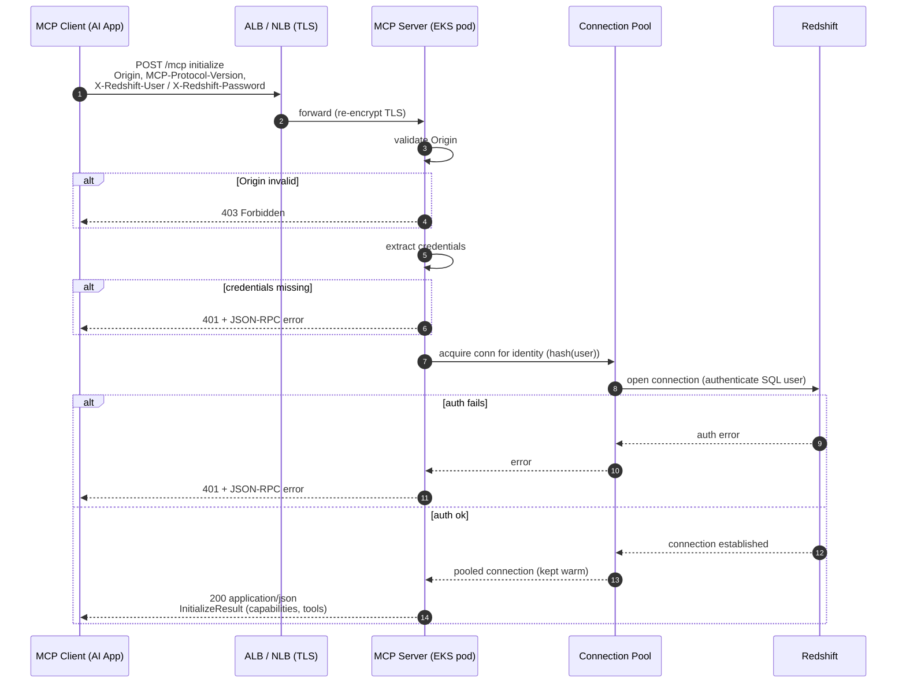
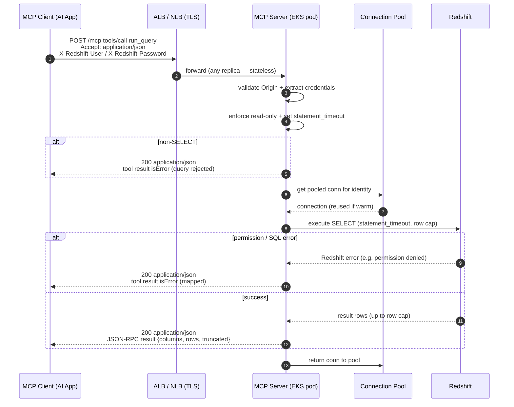

# Redshift MCP Server — Design Specification

**Status:** Implemented & deployed
**Last updated:** 2026-05-30
**Transport:** Streamable HTTP (MCP spec `2025-06-18`)

---

## 1. Overview

A centrally hosted MCP server that exposes Amazon Redshift to AI applications as MCP
tools. End users authenticate with **native Redshift SQL credentials** (users/groups)
supplied through their MCP client configuration. The server is a thin, stateless,
authenticated proxy: **all authorization is delegated to Redshift's native RBAC**
(SQL users, groups, and `GRANT`/`REVOKE`).

### Goals
- Use SQL-based users/groups for authentication to Redshift.
- End users provide credentials via their MCP client config (no server-side user store).
- Central hosting on EC2 behind CloudFront + ALB, horizontally scalable.
- Streamable HTTP transport.
- Structured JSON logs shipped to CloudWatch Logs.

### Implementation
- **Framework:** FastMCP (Python) with `stateless_http=True`, served via uvicorn (ASGI).
- **Infrastructure:** CloudFormation stack (CloudFront → public ALB → EC2, private subnet).

### Non-goals
- Implementing the MCP OAuth 2.1 authorization framework (see §3).
- Managing or storing end-user credentials server-side.
- Performing application-level authorization (Redshift enforces it).

---

## 2. Relevant MCP specification constraints (`2025-06-18`)

### Streamable HTTP transport
- Server exposes a **single MCP endpoint** (e.g. `/mcp`) supporting POST and GET.
- **POST**: each client→server JSON-RPC message is a new POST. Server MAY respond with
  either `application/json` (single object) or `text/event-stream` (SSE). **This server
  always responds `application/json`** (non-streaming); SSE is not used.
- **GET**: optionally opens an SSE stream for server-initiated messages; this server
  returns `405 Method Not Allowed` (no server-initiated stream).
- **Session management**: server MAY assign `Mcp-Session-Id` at initialization; if it
  does, clients must echo it on every subsequent request.
- **Security**: server MUST validate the `Origin` header (DNS-rebinding defense) and
  SHOULD authenticate all connections.
- Clients MUST send `MCP-Protocol-Version` header after initialization.

### Authorization
- Authorization is **OPTIONAL** in MCP.
- The built-in framework is **OAuth 2.1 only**, and servers **MUST NOT** pass through
  client tokens to upstream systems (token-passthrough is forbidden).
- **Implication:** the OAuth framework does not fit native DB-credential pass-through.
  This design intentionally does not implement it and instead uses transport-level
  credential passing over TLS (permitted, since authorization is optional).

---

## 3. Key design decisions

| # | Decision | Rationale |
|---|----------|-----------|
| D1 | **Credential pass-through via custom headers**, not OAuth | Use native Redshift SQL creds; OAuth framework forbids the passthrough this use case requires |
| D2 | **Delegate authorization to Redshift RBAC** | The SQL user's group GRANTs already define access; no duplicate authz layer needed |
| D3 | **Stateless server** (no reliance on `Mcp-Session-Id`) | Enables trivial horizontal scaling on EKS; avoids sticky sessions / shared session store |
| D4 | **Custom `X-Redshift-*` headers**, not `Authorization: Basic` | `Authorization` is reserved by the MCP OAuth layer / special-cased by some clients; custom headers pass through cleanly |
| D5 | **Per-identity connection pooling** | Avoids per-request connection cost and respects Redshift connection limits |
| D6 | **Non-streaming: POST→JSON; GET→405** | Simpler stateless model; responses are buffered single JSON objects, row-capped to bound size. No SSE / server-initiated stream needed |

---

## 4. Architecture

```
AI App (MCP client)
  │  HTTPS (trusted *.cloudfront.net cert)
  │  headers: MCP-Protocol-Version, X-Redshift-User, X-Redshift-Password
  ▼
CloudFront (<your-distribution>.cloudfront.net)
  • Caching disabled; AllViewer policy (forwards all headers including X-Redshift-*)
  • HTTP 80 origin fetch  ← non-prod; see §9 security note
  ▼
Public ALB (internet-facing)
  • SG locked to CloudFront origin-facing managed prefix list
  • HTTP 8080 → EC2
  ▼
EC2 (private subnet, no public IP)   ── FastMCP stateless HTTP server
  • uvicorn server:app, 2 workers
  • Per-identity Redshift connection pool
  • JSON logs → /var/log/redshift-mcp/app.log
  ▼
CloudWatch Logs (/redshift-mcp/app)             ← CloudWatch agent on instance

EC2 ──TCP 5439──▶ Amazon Redshift
                   Authorization enforced by SQL user GRANTs
```

### Network
- ALB subnets: ≥2 public subnets in different AZs
- EC2 subnet: 1 private subnet with NAT egress
- EC2 SG: accepts app port from ALB SG only
- ALB SG: accepts port 80 from CloudFront managed prefix list only
- Redshift SG: accepts 5439 from EC2 SG

---

## 5. Authentication & credential flow

### 5.1 Client configuration
End users supply credentials in their MCP client config `headers` block:

```json
{
  "mcpServers": {
    "redshift": {
      "url": "https://<your-cloudfront-domain>/mcp",
      "headers": {
        "X-Redshift-User": "analyst_jdoe",
        "X-Redshift-Password": "<password>"
      }
    }
  }
}
```

### 5.2 Server handling
1. On **every** request: `Origin` is validated by middleware (`403` on mismatch).
2. Credentials are extracted via `get_http_headers()` (FastMCP dependency injection) and
   validated on first use. Missing credentials → `ToolError` (surfaced as MCP `isError`
   result). Bad credentials (Redshift auth failure) → `ToolError`.
3. On tool calls: resolve a pooled connection for the identity and execute.
4. Redshift SQL/permission errors map to `ToolError` results; no special HTTP status.

> Note: credential errors return as MCP tool-level errors (`isError: true`), not as HTTP
> `401`, because FastMCP's tool model surfaces errors in-band. Origin mismatches still
> return HTTP `403` via the middleware layer.

---

## 6. Connection management

Per-identity pool keyed by a hash of the credentials, with idle eviction. One user's
calls reuse warm connections; pools are bounded to respect Redshift limits.

```python
# Crux only: per-request connection resolution
def get_conn(user: str, pwd: str):
    key = hashlib.sha256(f"{user}:{pwd}".encode()).hexdigest()
    pool = POOLS.get(key) or POOLS.setdefault(
        key, ConnectionPool(user=user, password=pwd, host=RS_HOST,
                            port=5439, dbname=RS_DB, max_size=4, idle_ttl=300))
    return pool.getconn()   # bad creds -> raise -> JSON-RPC error + HTTP 401
```

Pool policy:
- `max_size` per identity small (e.g. 2–4); global cap across identities.
- Idle TTL (e.g. 300s) to release abandoned identities.
- Evict on auth failure so rotated/incorrect creds don't pin a dead pool.

---

## 7. Tool surface

Tools are intentionally thin; Redshift enforces visibility per user.

| Tool | Purpose | Notes |
|------|---------|-------|
| `list_schemas` | Enumerate schemas | `svv_*` / `information_schema` |
| `list_tables` | Tables in a schema | filtered by user grants automatically |
| `describe_table` | Columns / types | |
| `run_query` | Execute SQL | **read-only enforced**, row/byte cap, statement timeout |

`run_query` safeguards:
- Reject non-`SELECT` (allow only `SELECT`/`WITH`/`SHOW`/`EXPLAIN`; single statement).
- `statement_timeout` to bound runtime.
- Row cap on the buffered result; response includes a `truncated` flag when the cap is hit.
- A user querying an ungranted object simply receives Redshift's permission error
  (desired behavior — no special handling needed).

---

## 8. Request/response behavior (transport)

| Method | Behavior |
|--------|----------|
| `POST /mcp` | JSON-RPC request → respond `application/json` (single buffered JSON object). Notifications/responses → `202 Accepted`, no body |
| `GET /mcp` | `405 Method Not Allowed` (no server-initiated stream; keeps server stateless) |
| `DELETE /mcp` | `405` (no server-side sessions to terminate) |

Headers honored: `Origin` (validated → `403` on mismatch), `MCP-Protocol-Version`
(`400` if unsupported), `X-Redshift-User` / `X-Redshift-Password` (credentials).
Responses are always `application/json`; the server does not emit SSE.

---

## 8.1 Sequence diagrams

### Initialize (eager credential validation)



### Tool call / query (`tools/call` → `run_query`)



---

## 9. Security considerations

- **TLS client→CloudFront only (non-prod).** CloudFront terminates TLS from clients. The
  **CloudFront→ALB** hop is HTTP over the public internet — Redshift credentials travel
  in cleartext on that leg. Accepted for non-prod. For production: use a custom domain +
  ACM cert on the ALB (end-to-end HTTPS) or a CloudFront VPC origin.
- **ALB locked to CloudFront IPs** — ALB SG accepts port 80 only from
  the CloudFront origin-facing managed prefix list.
- **Origin validation** — `_OriginCheck` middleware rejects non-allowlisted `Origin`
  headers with `403`. ALLOWED_ORIGINS is empty (allows non-browser MCP clients).
- **Credentials never logged** — `X-Redshift-*` headers and passwords are not written to
  any log. Only the SQL username is emitted (for audit) alongside tool name, status, and
  duration in the JSON log file.
- **No credential persistence** — credentials live only in memory for the life of a
  pooled connection; never written to disk or logged.
- **Resource protection** — `statement_timeout`, 1000-row result cap, bounded per-identity
  pool (max 4 connections, 300 s idle TTL).

### Tradeoff (flag to stakeholders)
SQL user/password credentials are **long-lived** (higher exposure than IAM temporary
credentials, manual rotation) and reside in users' local MCP config files. The
architecture allows a later swap — header credential → short-lived token mapped to a
Secrets Manager secret, or Redshift IAM `GetClusterCredentials` — **without** changing
the transport or tool design.

---

## 10. Deployment

Deployed via CloudFormation. See `deploy.md` for the full runbook. Key facts:

- **Infrastructure:** CloudFront → public ALB → EC2 `t4g.xlarge` (arm64, private subnet).
- **Runtime:** Amazon Linux 2023, Python 3.11, FastMCP + uvicorn, systemd service
  (`redshift-mcp`), 2 uvicorn workers. Stateless — any worker handles any request.
- **App artifact:** packaged as `redshift-mcp.tar.gz`, stored in S3,
  downloaded at instance launch via instance role.
- **Logs:** JSON structured logs at `/var/log/redshift-mcp/app.log`, shipped to
  CloudWatch Logs group `/redshift-mcp/app` via the CloudWatch agent.
- **Health:** `/healthz` endpoint used by the ALB target group health check.
- **Update:** re-upload artifact to S3, then `sudo systemctl restart redshift-mcp` on
  the instance (via SSM Session Manager).

---

## 11. Open questions / future improvements
- **Production TLS:** CloudFront→ALB hop is HTTP (non-prod accepted). For prod: custom
  domain + ACM cert, or CloudFront VPC origin.
- **Credential rotation UX:** SQL passwords are long-lived and live in client config
  files. Consider rotating via Secrets Manager + per-request token lookup as a follow-on.
- **Global Redshift connection budget:** the per-identity pool caps at 4 connections each,
  but no global cap is enforced server-side. Monitor `padb_relation_state` /
  `stv_sessions` and tune `POOL_MAX_IDLE` if Redshift connection limits are hit.
- **Read-only enforcement:** currently regex-based (`SELECT`/`WITH`/`SHOW`/`EXPLAIN`).
  A Redshift read-only group with `REVOKE WRITE` is a stronger server-side control.
