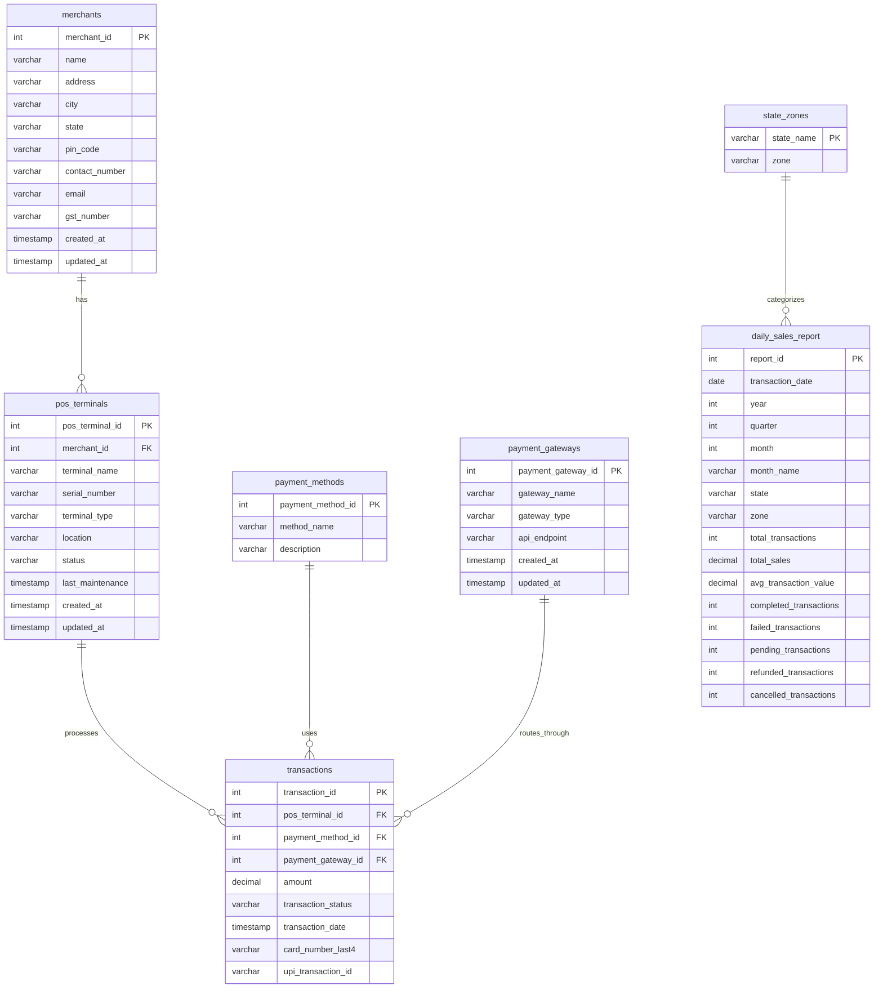

# Sales Data Preparation Module

A comprehensive synthetic data generation system for fintech payment processing, designed to create realistic transaction data for testing, development, and analytics purposes.

## Overview

This module generates synthetic data for a complete payment processing ecosystem, including merchants, POS terminals, payment methods, gateways, and transactions. The generated data follows realistic patterns and distributions based on Indian fintech market characteristics.

## Features

- **Realistic Data Generation**: Creates synthetic data that mirrors real-world payment processing patterns
- **Geographic Distribution**: Supports zone-based transaction distribution across Indian states
- **Multiple Payment Methods**: Supports credit cards, debit cards, UPI, net banking, wallets, and more
- **Transaction Status Simulation**: Realistic distribution of completed, failed, pending, refunded, and cancelled transactions
- **Temporal Data**: Generates transactions across a configurable date range (April 2024 - July 2025)
- **Aggregated Reporting**: Creates daily sales reports with zone, state, and temporal aggregations
- **Performance Optimized**: Uses batch processing and SQLAlchemy for efficient data insertion

## Database Schema

### Entity Relationship Diagram



### Table Descriptions

#### Core Tables

**merchants**
- Primary entity representing payment processing merchants
- Contains business information including GST numbers and contact details
- Distributed across Indian states with realistic geographic patterns

**pos_terminals**
- Point-of-sale terminals owned by merchants
- Each merchant has 2-5 terminals with different types (MOBILE, DESKTOP, KIOSK, etc.)
- Includes maintenance tracking and status management

**payment_methods**
- Supported payment methods (Credit Card, Debit Card, UPI, Net Banking, etc.)
- Includes descriptive information for each payment type

**payment_gateways**
- Payment gateway providers (Razorpay, Paytm, Stripe, etc.)
- Contains API endpoints and gateway type classifications

**transactions**
- Core transaction records with realistic amount distributions
- Links terminals, payment methods, and gateways
- Includes payment-specific fields (card last 4 digits, UPI transaction IDs)

#### Reporting Tables

**state_zones**
- Maps Indian states to geographic zones (North, South, East, West, Central, Northeast)
- Used for regional analysis and reporting

**daily_sales_report**
- Aggregated daily sales data by state and zone
- Pre-calculated metrics for performance optimization
- Includes transaction status breakdowns and temporal dimensions

## Installation

1. **Install Dependencies**
   ```bash
   pip install -r requirements.txt
   ```

2. **Configure Database Connection**
   Create a `.env` file with your PostgreSQL credentials:
   ```env
   DB_HOST=localhost
   DB_PORT=5432
   DB_NAME=paymentsdb
   DB_USERNAME=your_username
   DB_PASSWORD=your_password
   ```

3. **Verify Database Connection**
   ```bash
   python3 db_connection.py
   ```

## Usage

### Quick Start - Generate All Data

```bash
chmod +x generate_all_data.sh
./generate_all_data.sh
```

This script will:
1. Test database connection
2. Clean any existing data (truncate tables)
3. Recreate all required database tables with fresh schema
4. Generate 100 merchants across Indian states
5. Create 20 payment gateways
6. Insert 10 payment methods
7. Generate 200-500 POS terminals
8. Create 200,000 realistic transactions
9. Build aggregated sales reports

### Database Management

**Clean Existing Data:**
```bash
# Interactive cleanup (recommended)
python3 cleanup_database.py

# Show current database status
python3 cleanup_database.py status

# Remove data but keep schema
python3 cleanup_database.py truncate

# Remove all tables and schema
python3 cleanup_database.py drop
```

**Table Management:**
```bash
# Recreate all tables (drops and creates fresh)
python3 create_tables.py recreate

# Only create tables (if they don't exist)
python3 create_tables.py create

# Only drop tables
python3 create_tables.py drop
```

### Individual Data Generation

Generate data for specific entities:

```bash
# Create database schema
python3 create_tables.py

# Generate merchants (100 records)
python3 generate_merchants.py

# Generate payment gateways (20 records)
python3 payment_gateways.py

# Generate payment methods (10 records)
python3 payment_methods.py

# Generate POS terminals (2-5 per merchant)
python3 pos_terminals.py

# Generate transactions (200,000 records)
python3 transactions.py

# Create sales report aggregations
python3 sales_report_table.py
```

### Data Analysis and Reporting

```bash
# Run comprehensive sales analysis
python3 query_sales_report.py
```

This generates reports including:
- Sales summary by geographic zone
- Monthly sales trends
- Top performing states
- Transaction status distributions
- Quarterly performance analysis

## Data Characteristics

### Geographic Distribution

Transactions are distributed across zones based on realistic market patterns, covering all 28 Indian states and 8 Union Territories:

- **South Zone**: 40% (Karnataka, Tamil Nadu, Kerala, Andhra Pradesh, Telangana, Puducherry, Lakshadweep)
- **West Zone**: 25% (Maharashtra, Gujarat, Rajasthan, Goa, Dadra and Nagar Haveli and Daman and Diu)
- **North Zone**: 20% (Delhi, Punjab, Haryana, Uttar Pradesh, Himachal Pradesh, Uttarakhand, Jammu and Kashmir, Ladakh, Chandigarh)
- **East Zone**: 10% (West Bengal, Bihar, Odisha, Jharkhand, Assam, Meghalaya, Manipur, Mizoram, Nagaland, Tripura, Sikkim, Arunachal Pradesh, Andaman and Nicobar Islands)
- **Central Zone**: 5% (Madhya Pradesh, Chhattisgarh)

### Transaction Patterns

- **Amount Range**: ₹10 - ₹10,000 with realistic distribution
- **Status Distribution**: 75% completed, 10% pending, 8% failed, 5% refunded, 2% cancelled
- **Date Range**: April 1, 2024 to July 31, 2025
- **Payment Methods**: Weighted distribution favoring popular methods (UPI, cards)

### Performance Characteristics

- **Batch Processing**: Inserts data in batches of 100 records for optimal performance
- **Indexing**: Optimized indexes on frequently queried columns
- **Connection Pooling**: SQLAlchemy connection pooling for concurrent operations

## Configuration

### Environment Variables

| Variable | Description | Default |
|----------|-------------|---------|
| `DB_HOST` | PostgreSQL host | `localhost` |
| `DB_PORT` | PostgreSQL port | `5432` |
| `DB_NAME` | Database name | `paymentsdb` |
| `DB_USERNAME` | Database username | Required |
| `DB_PASSWORD` | Database password | Required |

### Customization Options

**Transaction Volume**: Modify the number of transactions in `transactions.py`:
```python
insert_transactions(200000)  # Change to desired count
```

**Date Range**: Update transaction date generation in `generate_transaction_date()`:
```python
start_date = datetime(2024, 4, 1)  # Modify start date
end_date = datetime(2025, 7, 31)   # Modify end date
```

**Geographic Distribution**: Adjust zone weights in `transactions.py`:
```python
ZONE_WEIGHTS = {
    'SOUTH': 0.40,   # Modify percentages
    'WEST': 0.25,
    # ... etc
}
```

## File Structure

```
sales-data-prep/
├── README.md                    # This documentation
├── requirements.txt             # Python dependencies
├── .env                        # Database configuration (create this)
├── generate_all_data.sh        # Master data generation script
├── db_connection.py            # Database connection utility
├── test_connection.py          # Database connection testing
├── create_tables.py            # Database schema creation/recreation
├── cleanup_database.py         # Database cleanup utility
├── generate_merchants.py       # Merchant data generation
├── payment_gateways.py         # Payment gateway data
├── payment_methods.py          # Payment method data
├── pos_terminals.py            # POS terminal data
├── transactions.py             # Transaction data generation
├── sales_report_table.py       # Sales report aggregation
├── query_sales_report.py       # Data analysis and reporting
├── validate_state_coverage.py  # State coverage validation
├── verify_date_range.py        # Date range verification
└── STATE_COVERAGE_VALIDATION.md # State coverage documentation
```

## Dependencies

- **SQLAlchemy**: Database ORM and connection management
- **psycopg2-binary**: PostgreSQL database adapter
- **Faker**: Realistic fake data generation
- **python-dotenv**: Environment variable management
- **pandas**: Data analysis and manipulation
- **tabulate**: Formatted table output
- **boto3**: AWS services integration (if needed)

## Performance Considerations

- **Batch Processing**: All data insertion uses batch operations for optimal performance
- **Connection Pooling**: SQLAlchemy manages database connections efficiently
- **Indexing**: Strategic indexes on frequently queried columns
- **Memory Management**: Large datasets are processed in chunks to manage memory usage

## Troubleshooting

### Common Issues

1. **Database Connection Errors**
   - Verify PostgreSQL is running
   - Check `.env` file configuration
   - Ensure database exists and user has proper permissions

2. **Memory Issues with Large Datasets**
   - Reduce batch size in transaction generation
   - Monitor system memory during data generation

3. **Slow Performance**
   - Ensure database indexes are created
   - Consider reducing transaction volume for testing
   - Check database connection pooling settings

### Verification Commands

```bash
# Test database connection
python3 test_connection.py

# Check current database status
python3 cleanup_database.py status

# Check table creation
python3 -c "from db_connection import db; print(db.fetch_all('SELECT tablename FROM pg_tables WHERE schemaname = \'public\''))"

# Verify data counts
python3 -c "from db_connection import db; print('Merchants:', db.fetch_one('SELECT COUNT(*) FROM merchants')[0])"

# Test transaction distribution
python3 transactions.py verify
```

## Contributing

When adding new data generation features:

1. Follow the existing pattern of using SQLAlchemy for database operations
2. Use batch processing for large datasets
3. Include realistic data distributions
4. Add appropriate error handling and logging
5. Update this README with new features

## License

This module is part of the Enterprise AI Assistant project and follows the same licensing terms.